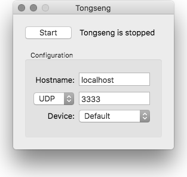

Tongseng
========

Tongseng is a [TUIO](http://tuio.org) wrapper for Mac OS X multitouch
events.  Now you can use the multitouch touch pad to send TUIO events to
your multitouch application!

Visit [TUIO.org](http://tuio.org) for more information about TUIO.

Usage
-----

1. Download [the application package](http://cloud.github.com/downloads/fajran/tongseng/Tongseng-0.4.dmg) (Intel only)
2. Open it
3. Run Tongseng
    
    
    
4. optionally change the TUIO/UDP port and host
5. optionally select an internal or external trackpad
6. Click the Start button to activate Tongseng

Then..

1. Run your TUIO-based multitouch application
2. Start touching your touchpad!

Compilation
-----------

### GUI Application

1. Retrieve the code. Using git

        $ git clone git://github.com/fajran/tongseng.git
    
    or by clicking [the download
	button](http://github.com/fajran/tongseng/tarball/master).

2. Open `TongsengApp/TongsengApp.xcodeproj` with Xcode.
3. Build the project.

### Command line application

1. Retrieve the code
2. Go to the source directory
3. Type `make` and return.

